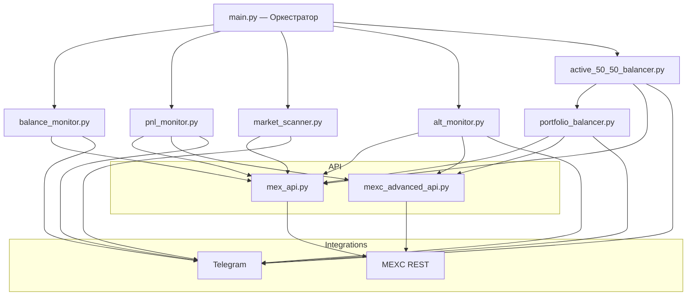
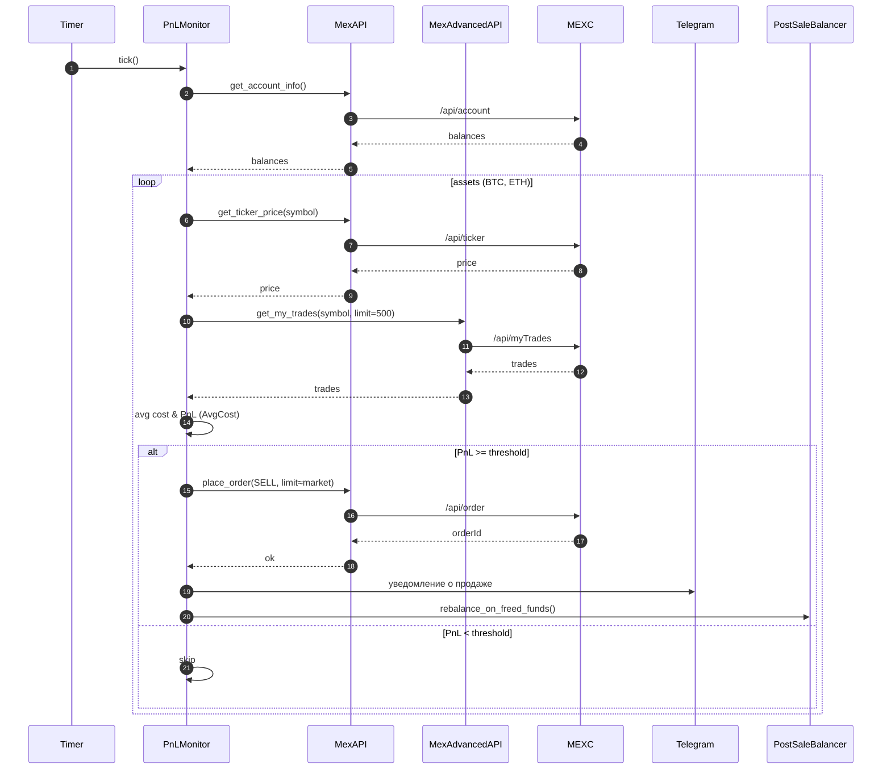
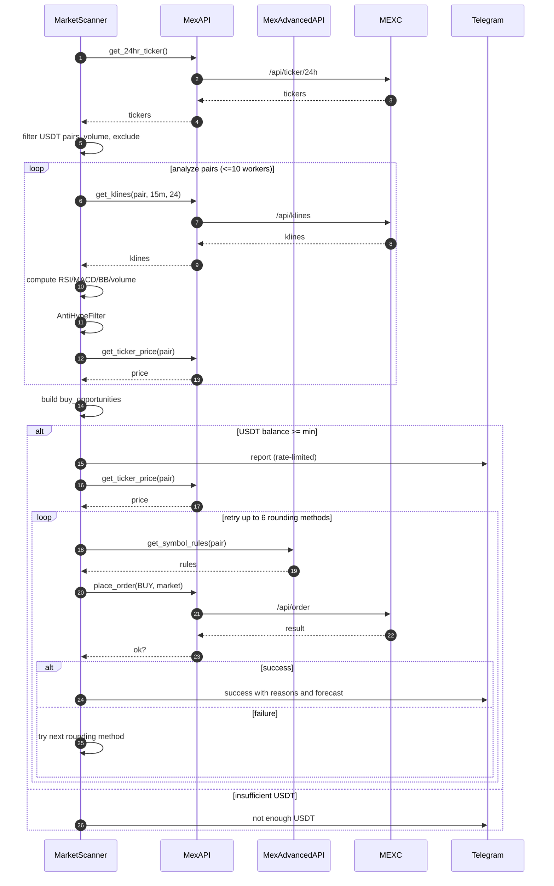

## ДЛЯ ПРОГРАММИСТОВ: как это вообще работает и куда копать

Спокойно. Это не монолит на соплях, но и не святой Грааль. Ниже — карта проекта, кто за что отвечает, где тонко и где лучше не ломать прод.

### Архитектура на пальцах
- Точка входа: `main.py` — запускает всё в потоках.
- Слой API:
  - `mex_api.py` — базовый REST (цены, свечи, ордера, баланс, стакан, тикеры) с ретраями.
  - `mexc_advanced_api.py` — правила лотов/точностей, комиссии, история сделок, min notional.
- Конфиг: `config.py` — ключи, Telegram, торговые параметры, исключённые символы.
- Основные сервисы (живут в проде):
  - `balance_monitor.py` — покупает BTC/ETH за USDC, лимитками около рынка, с фильтрами и защитой остатка.
  - `pnl_monitor.py` — считает PnL по средним ценам из истории сделок, продаёт при профите, шлёт отчёты, пингует `PortfolioBalancer`.
  - `market_scanner.py` — фоново сканит USDT‑рынки, считает индикаторы, отсекает хайп, может покупать.
  - `alt_monitor.py` — следит за «дешёвыми» альтами, фиксирует профит, при деньгах докупает топ‑альты.
  - `active_50_50_balancer.py` — держит 50/50 Альты vs BTC/ETH через USDC.
  - `portfolio_balancer.py` — «мозги» балансировки BTC/ETH; теперь с реальным PnL (через `mexc_advanced_api`).

PM2 гоняет `main.py` как процесс `mexc`. Логи смотрим там же. Telegram — твой лучший друг и худший критик.

### Потоки данных и решения
- Цены/стаканы — `mex_api.py` (с ретраями и запасом на фейлы).
- Правила лотов и история сделок — `mexc_advanced_api.py`.
- PnL:
  - `pnl_monitor.py` — считает AvgCost по сделкам и принимает решения на продажу.
  - `portfolio_balancer.py` — считает PnL по активам перед SELL/BUY (чтобы не продавать в минус).

### Где за что отвечают (чтобы не путать)
- Покупки BTC/ETH за USDC: `balance_monitor.py` (лимитки, мейкер, кулдауны, остаток USDC).
- Продажи BTC/ETH по профиту: `pnl_monitor.py` (лимитка чуть ниже рынка, чтобы исполнилось быстро).
- Скан и покупки альтов (USDT): `market_scanner.py` (индикаторы, анти‑хайп, ретраи округлений количества).
- Портфель 50/50: `active_50_50_balancer.py` (быстрый контроль перекосов) + `portfolio_balancer.py` (глубокая логика для BTC/ETH).
- Альты вне BTC/ETH: `alt_monitor.py` (фикс профита > порога; аккуратные лимитки рядом с рынком).

### Правила безопасности (не ломай)
- Минимальные лоты и точности — всегда через `mexc_advanced_api.py`. Ручные округления нужны только как фоллбек.
- Остаток USDC должен жить — не опускаем ниже защитного минимума (в коде есть жёсткие проверки).
- Кулдауны у покупок/балансировок — не трогай на горячую, лучше сделать параметром.
- Телеграм‑спам — урезан счётчиками. Если лить водопад логов — тебя возненавидят (и бан за спам тоже никто не отменял).

### Где тонко (и ломается)
- Биржевые правила меняются, API иногда «мямлит». Будь добр — ретраи и фоллбеки не выкидывать.
- История сделок может быть неполной — расчёт средней цены должен держать нулевые/битые данные.
- Конвертация USDC/USDT: курс около 1, но не бог. В редких случаях учитывай `USDCUSDT`.
- Параллельщина в сканере: не делай 100 потоков. 10 — потолок, иначе улетишь в лимиты/таймауты.

### Рефакторинг — куда копать (и не материться громко)
- Общий расчёт PnL:
  - Вынести AvgCost‑логику в модуль `utils/pnl.py` и использовать в `pnl_monitor.py`, `portfolio_balancer.py`, `alt_monitor.py`.
  - Нормализовать входные поля трейдов (встречаются `price/p`, `qty/q`, `quoteQty/quote_qty`).
- Единый Telegram‑нотификатор:
  - Сделать `utils/telegram.py` с бэкоффом, лимитом частоты, шаблонами сообщений (устал уже копировать бото‑форматирование?).
- Конфиг/флаги:
  - Перенести интервалы/пороги/ограничения в `config.py` с валидацией. Сейчас часть значений размазана по файлам.
- Ошибки API:
  - Ввести общий декоратор ретраев с логикой «тихих» повторов и финальным отчётом. Сейчас подобная логика скопипащена в нескольких местах.
- Трейдинг‑правила и округления:
  - Завернуть в `utils/exchange_rules.py` (получение, кеширование, валидации minQty/stepSize/precision).
- Логи/метрики:
  - Ротация файлов уже есть в PnL; стоит унифицировать везде и добавить простые метрики (кол-во операций, средний PnL, среднее время сделки).

### Куда смотреть при отладке
- PM2: `pm2 status`, логи: `pm2 logs mexc | cat` — быстро видно, кто упал, кто матерится в логах.
- Telegram: сообщения с эмодзи — не мемы, а телеметрика. Читай внимательно, там причины решений.
- Если «ничего не покупает»: смотри минимумы лотов, защиту USDC, кулдауны и анти‑хайп фильтры (они реально режут активность).

### FAQ для тех, у кого горит
- «Почему не покупает BTC/ETH?» — USDC мало? Кулдаун? Ребаланс‑фильтр сказал «сидим»? Минимальный лот не пролезает?
- «Почему не продаёт в плюс?» — средняя цена по истории сделок может быть выше, чем ты думаешь. Проверь расчёт AvgCost и комиссии.
- «Почему сканер молчит?» — USDT < $6 или top‑пары отфильтрованы. Либо ты в лимитах API, дружище.

### Стиль и договорённости (чтобы код не стал свалкой)
- Блоки кода размечены крупными разделами комментов. Поддерживай эту структуру — она экономит нервы.
- Имена переменных/функций — нормальные человеческие, не `x` и не `doIt()`.
- Ошибки не глотаем: либо ретрай, либо нормальный отчёт в лог/Telegram.

### Итог
Система уже рабочая: покупает, продаёт, балансирует и отчитывается. Главные риски — биржевые правила и неполные данные истории. Если аккуратно вынести общие куски (PnL, Telegram, правила лотов) в утилиты и централизовать ретраи/конфиг — жить станет легче. И да, не ломайте защиту USDC, иначе будете чинить в пятницу ночью. Никому это не надо.

Удачи. И пусть прод не падает. Если что — виноват предыдущий программист (шутка… или нет).

### Диаграммы (Mermaid)

Архитектура (высокоуровневая):

Последовательность: Продажа по PnL (PnLMonitor)

Последовательность: Автопокупка альта (MarketScanner)

